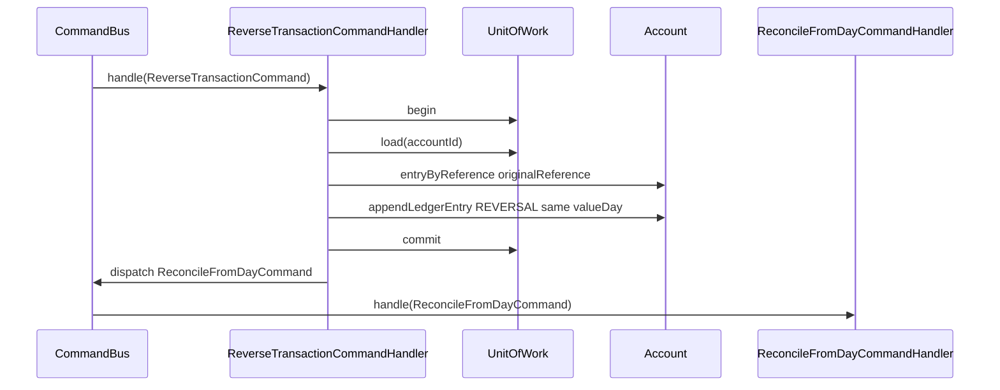

# ARCHITECTURE.md

This file records every design decision for the in-memory banking ledger. Refused assignment criteria and abandoned approaches live only in [REJECTED.md](REJECTED.md). Open arithmetic questions live in [AMBIGUITIES.md](AMBIGUITIES.md).

No database, web layer, UI, Spring, or Kafka. Java 21, Maven, JUnit 5, in-memory only.

---

## 1. Overview

The identity type is **`Account`**. It owns:

- identity: `id`, `currency`, `openingBalanceInMinorUnits` (these fields do not live on `AccountState`)
- `ConcurrentHashMap<String, LedgerEntry>` keyed by **idempotency key** (`putIfAbsent`)
- `ConcurrentHashMap<String, Authorization>` keyed by **idempotency key** (`putIfAbsent`)
- `AtomicReference<AccountState>` for booked amount, holds, reversed refs, daily accruals, capitalized interest, version

Every command handler uses **`UnitOfWorkFactory` only**. None inject `AccountRepository`. `InMemoryUnitOfWork` is the only class that uses the repository.

There is no event store, no `DomainEvent`, no `EventBus`, and no `AccountState.apply(event)`.

```text
Command
  -> CommandBus
  -> CommandHandler
  -> UnitOfWork.begin / load or registerNew
  -> Account.appendLedgerEntry or appendAuthorization
  -> UnitOfWork.commit
```

Reverse is the only posting handler that, **after commit**, dispatches `ReconcileFromDayCommand`. The simulation engine wraps other backdated postings (E7, E10) with that same command.

---

## 2. Why not event sourcing

E7/E9, fees, and interest are closing-balance problems over `valueDay`.

```text
closing(day) = opening + sum(signed amounts where valueDay <= day)
```

The entry map is unordered. Reconciliation loads entries **sorted by `valueDay` ASC, then `sequence` ASC** and computes a **local** running total. Existing ledger rows are never mutated.

`putIfAbsent` is the uniqueness check. `UnitOfWork.commit` is the only persistence call a handler makes.

A traditional event-sourced `AccountState.apply(event)` plus event store was considered and **rejected**. See [REJECTED.md](REJECTED.md).

---

## 3. Decision log

These are the decisions. Each one is in force unless [REJECTED.md](REJECTED.md) records the opposite as abandoned.

### Identity and state

1. **`Account` is the aggregate.** `id`, `currency`, and `openingBalanceInMinorUnits` live only on `Account`.
2. **`AccountState` is immutable scalars** behind `AtomicReference`: `amountInMinorUnits`, `holdAmountInMinorUnits`, `reversedReferenceIds`, `accruedDailyInterestByDay`, `capitalizedInterestInMinorUnits`, `version`.
3. **`AccountState` does not hold** id, currency, opening, entries, authorizations, errors, or processed command keys.
4. **Ledger entries and authorizations live on `Account`**, in `ConcurrentHashMap`s keyed by idempotency key.
5. **Idempotency is `putIfAbsent`.** A second append with the same key returns the existing row and does not change amount.

### Ledger rows

6. **Every `LedgerEntry` has `balanceBeforeInMinorUnits` and `balanceAfterInMinorUnits`.** Both are required fields on the committed row.
7. **`appendLedgerEntry` stamps those fields at append time** from the CAS'd `AccountState.amountInMinorUnits` (posting-order running total), `putIfAbsent`s the complete row, CASes amount to `balanceAfter`, then the handler `commit`s. The fields are not filled later as a report-only step.
8. **`balanceBefore` / `balanceAfter` are write-once.** Recon does not `replace`, `withBalances`, or otherwise update existing rows.
9. **Same-day order** uses a monotonic `sequence` assigned on append (not hash iteration).
10. **A reversal keeps the original `valueDay`.** Compensating `REVERSAL` is a new row; the original debit stays.

### Persistence and handlers

11. **Handlers take `UnitOfWorkFactory` only.** They never receive `AccountRepository`.
12. **`UnitOfWork`:** `begin`, `load`, `registerNew`, `commit`. `InMemoryUnitOfWork` is the only repository client.
13. **`InMemoryAccountRepository`** is `ConcurrentHashMap<String, Account>`.
14. **Write path in the engine is only `CommandBus.dispatch`.** The engine does not inject `AccountRepository`. End-of-day batch account ids come from **config**.
15. **One handler per command.** Credit and debit are two commands (`BookCreditCommand`, `BookDebitCommand`), not one combined booking command.
16. **No `EventBus`.** Command diagrams do not include `AccountRepository` or `SimulationEngine`. Reverse is the only posting diagram that includes reconcile.

### Available balance

17. **Available = `amountInMinorUnits - holdAmountInMinorUnits`** (all holds).
18. **Debit and authorize must call `ensureSufficientAvailable`** before append. Insufficient debit: no ledger row, no commit, `CommandResult` with `INSUFFICIENT_AVAILABLE_BALANCE`.
19. **Credit does not check available.**
20. **Authorize decline** still `appendAuthorization(DECLINED)` and `commit` so no hold is applied.
21. **Authorize fail-closed** on commit conflict: `CONCURRENT_MODIFICATION`.

### Reverse and reconcile

22. **`ReverseTransactionCommand` only books `REVERSAL`.** It does not inline fee rows or accrual rewrites.
23. **After reverse `commit`, the handler dispatches `ReconcileFromDayCommand`** from the original `valueDay` through last closed day (max key in `accruedDailyInterestByDay`). Two commits; one reverse from the caller's point of view.
24. **If nothing is closed yet** (`lastClosedDay < valueDay`), skip recon; the next `EndOfDayCommand` assesses that day.
25. **Credit, debit, instalments, authorize, and settle do not dispatch recon.** The engine wrap does, for backdated postings that those handlers do not cover (E7, E10).
26. **The engine does not dispatch a second recon after E9.** Reverse already ran it.
27. **`ReconcileFromDayCommand` is its own command.** Called from reverse and from the engine wrap. Idempotent. One commit.
28. **Recon load order:** all entries sorted `valueDay` ASC, then `sequence` ASC.
29. **Recon `running` starts at the first sorted entry's `balanceBeforeInMinorUnits`**, then adds each signed amount in local variables. It does not seed from opening.
30. **Recon may append new `OVERDRAFT_FEE` / `FEE_REVERSAL` rows** through `appendLedgerEntry` (those new rows get before/after at append). It does not update old rows.
31. **A day's own fee is excluded** from that day's negativity test (postings-only closing).
32. **Following days are in scope.** A reversal or backdated posting can change every later closing; recon walks `fromDay` through `toDay` inclusive.

### End of day, interest, fees

33. **`EndOfDayCommand` always writes `accruedDailyInterestByDay[day]`.** Positive closing: `InterestPolicy` at 4/10000, rounding **DOWN**. Zero or negative closing: accrue `0`.
34. **Negative postings-only closing also appends `OVERDRAFT_FEE`.** Accrual is not a ledger row.
35. **Capitalization (day 6) is one `INTEREST_CAPITALIZATION` credit** equal to the **sum of the accrual map**. There is no independently calculated remainder to discard.
36. **Capitalization is excluded from daily closings until report day >= 6.**
37. **Overdraft fees** are config integers in minor units: AED `2500`, BHD `25000` (BHD fee is invented; see [AMBIGUITIES.md](AMBIGUITIES.md)).

### Money, config, errors, reports

38. **All money is `long` minor units.** AED scale 2, BHD scale 3. No `BigDecimal`, `float`, or `double` for booked amounts.
39. **All ledger constants live in `application.yaml`.** Fees, rates, opening balances, window days, rounding mode.
40. **E10 splits BHD 10.000 as `3334 / 3333 / 3333`** minor units (exact total preserved).
41. **Errors live on `CommandResult` / `SimulationResult`**, not on `AccountState`. Runtime declines (E6, E8, insufficient debit) are **not** appended to `REJECTED.md` when the simulation runs.
42. **Refused assignment criteria and abandoned designs live only in `REJECTED.md`.** They are not stored on `AccountState` and are not mixed into the verified arithmetic as alternate goldens.
43. **`ReportBuilder` reads `Account` plus `SimulationResult` errors.**
44. **Package root is `com.mal.assignment`.** Hexagonal layout: domain ports (`repositories`, `unitofwork`, `buses`) and infrastructure adapters.

### Process

45. **Review gate after every implementation task.** Tests + lints, then wait for approval before commit.
46. **Intentionally failing test:** backdated posting after Day 6 capitalization, tagged `known-limitation`.

---

## 4. What lives where

### Account

```java
public LedgerEntry appendLedgerEntry(LedgerEntry draft) {
    long before = current().amountInMinorUnits();
    long after = before + draft.signedAmountInMinorUnits();
    LedgerEntry row = draft.withBalances(before, after);
    LedgerEntry existing = entries.putIfAbsent(row.idempotencyKey(), row);
    if (existing != null) {
        return existing;
    }
    casAmountTo(after);
    return row;
}

public void ensureSufficientAvailable(long requestedInMinorUnits) {
    if (current().availableBalanceInMinorUnits() < requestedInMinorUnits) {
        throw new InsufficientAvailableBalanceException(id, requestedInMinorUnits);
    }
}
```

`availableBalanceInMinorUnits()` = `amountInMinorUnits - holdAmountInMinorUnits`.

### Unit of work

```java
interface UnitOfWorkFactory {
    UnitOfWork begin();
}

interface UnitOfWork {
    Optional<Account> load(String accountId);
    void registerNew(Account account);
    CommitResult commit();
}
```

Handler shape (all commands):

```text
uow = factory.begin()
account = uow.load(id)   // or registerNew for open
account.ensureSufficientAvailable(amount)  // debit and authorize only
account.appendLedgerEntry(...)             // stamps balanceBefore / balanceAfter
uow.commit()
// reverse only: commandBus.dispatch(ReconcileFromDayCommand from valueDay through lastClosedDay)
```

---

## 5. Packages

```text
com.mal.assignment
├── accounts
│   ├── domain
│   │   ├── models             Account, AccountState, Authorization,
│   │   │                      LedgerEntry, LedgerEntryType, Currency, MinorUnits,
│   │   │                      FailureReason, LedgerError
│   │   ├── commands           sealed Command hierarchy
│   │   ├── commandhandlers    one handler per command; UnitOfWorkFactory only
│   │   ├── repositories       PORT: AccountRepository (UnitOfWork adapter only)
│   │   ├── unitofwork         PORT: UnitOfWork, UnitOfWorkFactory, CommitResult
│   │   ├── buses              PORT: CommandBus (no EventBus)
│   │   ├── services           OverdraftPolicy, InterestPolicy, ReconciliationTrigger, LedgerPolicies
│   │   └── reports            DailySnapshot, DailyReport, ScenarioReport, ReportBuilder
│   └── infrastructure
│       ├── repositories       InMemoryAccountRepository
│       ├── unitofwork         InMemoryUnitOfWork, InMemoryUnitOfWorkFactory
│       ├── buses              InMemoryCommandBus
│       ├── config             LedgerConfig + YamlLedgerConfigLoader
│       └── reports            ReportPrinter
├── simulation                 SimulationEngine, ScenarioFixture, Checkpoint, SimulationResult
└── ReplayMain
```

`AccountsModule` wires `InMemoryUnitOfWorkFactory(accountRepository)` into every handler.

---

## 6. Commands

| Command | Behaviour |
|---|---|
| `OpenAccountCommand` | `registerNew` + `commit`. Adapter `putIfAbsent` inside the unit of work. |
| `BookCreditCommand` | Append `CREDIT`. No available check. |
| `BookDebitCommand` | `ensureSufficientAvailable` then append `DEBIT`. E2 and E7. |
| `CreditInstalmentsCommand` | E10: three rows `E10:1/2/3`, one commit. |
| `AuthorizeCommand` | `ensureSufficientAvailable` then `APPROVED`; else `DECLINED` + commit. No ledger row. |
| `SettleAuthorizationCommand` | `SETTLEMENT` + full hold release. Unknown auth (E6) → `CommandResult` error. |
| `ReverseTransactionCommand` | `REVERSAL` same `valueDay`, commit, dispatch `ReconcileFromDayCommand`. |
| `EndOfDayCommand` | Fee if negative; always `accrueInterestForDay`. One commit. |
| `ReconcileFromDayCommand` | Sorted value-date walk; append fee/fee reversal if needed; overwrite accruals. |
| `CapitalizeInterestCommand` | `INTEREST_CAPITALIZATION` = sum of accrual map. |
| `EndOfDayBatchCommand` | Engine loops config account ids and dispatches `EndOfDayCommand`. |

### Reverse then reconcile



### Reconcile load (no update of existing rows)

```java
List<LedgerEntry> ordered = account.ledgerEntriesSortedByValueDay();
if (ordered.isEmpty()) {
    return;
}
long running = ordered.getFirst().balanceBeforeInMinorUnits();
for (LedgerEntry entry : ordered) {
    running += entry.signedAmountInMinorUnits();
}
// fromDay..toDay: append fee or fee reversal if needed; accrueInterestForDay
```

---

## 7. Simulation engine wrap

Engine only `CommandBus.dispatch`. Catch-up EOD, then the posting command, then `ReconcileFromDayCommand` if a closed day was affected **and the posting handler did not already run recon**.

Schedule:

```text
E1, E2, EOD-D1, E3, EOD-D2, E4, EOD-D3, E5, E6, EOD-D4,
E7, RECON(ACC-001, D2..D4),
E8, EOD-D5,
E9 (reverse runs RECON D2..D5 internally),
E10(late), RECON(ACC-002, D5..D5),
EOD-D6, CAPITALIZE
```

---

## 8. Config

```yaml
ledger:
  window-days: 6
  rounding-mode: DOWN
  currencies:
    AED: { scale: 2 }
    BHD: { scale: 3 }
  interest:
    daily-rate-numerator: 4
    daily-rate-denominator: 10000
    capitalization-day: 6
  overdraft:
    fees-in-minor-units:
      AED: 2500
      BHD: 25000
  accounts:
    - id: ACC-001
      currency: AED
      opening-balance-in-minor-units: 0
    - id: ACC-002
      currency: BHD
      opening-balance-in-minor-units: 0
```

---

## 9. Verified arithmetic (reference)

All figures in minor units. Unchanged by the storage model.

If E7 is booked: ACC-001 D1–D6 closings `25000, 25000, 65000, 46500, 46500, 46600` (report `250.00 … 466.00`). ACC-002 D5 `10000`, D6 `10008`. Capitalized: ACC-001 `100`, ACC-002 `8`. E7 causes **three** fees (D2, D4, D5). E8 Auth-B **declined**.

The debit-available check vs booking E7 into overdraft is recorded only in [REJECTED.md](REJECTED.md). Original goldens from E7 onward that assume E7 booked are not shipped as passing tests if that check is enforced.

---

## 10. Tests that lock the architecture

- `AccountsModuleTest` — handlers constructed with `UnitOfWorkFactory` only
- `InMemoryUnitOfWorkTest` — handlers stub `UnitOfWork`, not the repository
- `AccountPutIfAbsentTest` — second append with same key is a no-op on amount
- `BookCreditTest` / `BookDebitTest` — committed row has both balance fields
- `ReconciliationTest` — sorted `valueDay` read; existing before/after unchanged
