# Architecture

In-memory value-dated banking ledger. Java 21, Maven, JUnit 5. Refused assignment criteria live in [REJECTED.md](REJECTED.md). Open arithmetic questions live in [AMBIGUITIES.md](AMBIGUITIES.md).

---

## 1. Model

**`Account`** is the aggregate. It holds identity (`id`, `currency`, `openingBalanceInMinorUnits`), booked amount, holds, reversed references, daily interest accruals, capitalized interest, version, an append-only map of `LedgerEntry`, and a map of `Authorization`.

The ledger is append-only. A posting, reversal, overdraft fee, fee reversal, or capitalization is a **new row**. Idempotency is `putIfAbsent` on the idempotency key: a second append with the same key returns the existing row and leaves amount unchanged.

`balanceBeforeInMinorUnits` / `balanceAfterInMinorUnits` are the booked amount **at append time** (posting order). They are not a value-day running total. A later row with the same or an earlier `valueDay` leaves those fields unchanged, so they go **stale** for closing. They match that day’s close only while that row is still the **last entry of the day** — no later append with `valueDay` less than or equal to that day. Daily close, interest, fees, and recon always use:

```text
closing(day) = opening + sum(signed amounts where valueDay <= day)
```

A day’s own `OVERDRAFT_FEE` / `FEE_REVERSAL` is omitted from that day’s negativity test (`postingsOnlyClosing`). Capitalization is omitted from daily closings while `day <` the cap row’s `valueDay`. Same-day walk order is `valueDay` ascending, then `idempotencyKey` ascending.

---

## 2. Why an append-only ledger

Event sourcing was considered. An event store and `apply` would have produced an auditable history of every mutation. On this problem that was the only extra value: E7, E9, fees, and interest are closing-balance questions over `valueDay`, which is a sorted read of the journal, not a projected event stream.

The implementation therefore keeps a journal of signed rows on `Account` and a committed snapshot behind `AtomicReference`. `UnitOfWork.commit` CASes that snapshot by reference.

---

## 3. Write path

```text
Command
  -> CommandBus
  -> CommandHandler
  -> domain service
  -> UnitOfWork.begin / load or registerNew
  -> Account.appendLedgerEntry or appendAuthorization
  -> UnitOfWork.commit
  -> posting service may dispatch ReconcileFromDayCommand
```

One handler per command. The handler maps `LedgerDomainException` to `CommandResult` via `HandlerSupport.from`. Services throw; they do not return `CommandResult`.

Handlers depend on the domain service. Services use `UnitOfWorkFactory`. `InMemoryUnitOfWork` talks to `AccountRepository`. `EndOfDayService` also receives `AccountRepository` so batch close can iterate `findAllIds()`.

`InMemoryAccountRepository` stores `ConcurrentHashMap<String, StoredAccount>`. Each `StoredAccount` is an `AtomicReference<Account>` plus a deep copy of maps and sets. `findById` returns a working copy. `snapshot` is the committed reference used as the CAS expected value.

```java
public LedgerEntry appendLedgerEntry(LedgerEntry draft) {
    long before = amountInMinorUnits;
    long after = before + draft.signedAmountInMinorUnits();
    LedgerEntry row = draft.withBalances(before, after);
    LedgerEntry existing = entries.putIfAbsent(row.idempotencyKey(), row);
    if (existing != null) {
        return existing;
    }
    amountInMinorUnits = after;
    version++;
    return row;
}
```

A `REVERSAL` also records `reversedReferenceIds`. `INTEREST_CAPITALIZATION` records `capitalizedInterestInMinorUnits`.

```java
interface UnitOfWork {
    Optional<Account> load(String accountId);
    void registerNew(Account account);
    long commit();
}
```

---

## 4. Money, holds, and overdraft

All amounts are `long` minor units (AED scale 2, BHD scale 3). Constants live in `application.yaml`.

**Available** = booked amount − holds. **Authorize** calls `ensureSufficientAvailable`. If available is too low, the service appends `DECLINED`, commits, and throws `INSUFFICIENT_AVAILABLE_BALANCE`. An approval stores `heldFromDay = lastClosedDay + 1`. Commit conflict is fail-closed (`CONCURRENT_MODIFICATION`).

**Debit** appends even when the booked amount goes negative. Overdraft is assessed at close / recon as a fee, not as a rejected command. Credit, instalments, and settle do not check available.

Daily **holds** on the report are reconstructed: approved authorizations with `heldFromDay <= day` that have no `SETTLEMENT` for that `referenceId` with `valueDay <= day`.

Interest is `floor(postingsOnlyClosing × 4 / 10000)` with rounding **DOWN**, and `0` when that closing is ≤ 0. Overdraft fees are AED `2500` and BHD `25000`. E10 splits BHD 10.000 as `3334 / 3333 / 3333`.

---

## 5. Reconcile

Credit, debit, instalments, settle, and reverse book their row, commit, then dispatch `ReconcileFromDayCommand` when `lastClosedDay >= valueDay`. `lastClosedDay` is the max key in `accruedDailyInterestByDay`. If no day is closed yet, the next `EndOfDayCommand` assesses it.

`ReconcileFromDayCommand` is its own command and one commit. It starts from the previous day’s full close (fees included) and walks each day:

```java
long running = account.closingBalance(command.fromDay() - 1);
for (int day = command.fromDay(); day <= command.toDay(); day++) {
    long closing = running + nonFeePostingsOn(day);
    // closing < 0 && netFee == 0  -> append OVERDRAFT_FEE
    // closing >= 0 && netFee < 0  -> append FEE_REVERSAL
    running = closing + account.netFeeSignedAmount(day);
    account.accrueInterestForDay(day, interestPolicy.dailyAccrual(closing));
}
```

A reversal is a new `REVERSAL` row on the original `valueDay`. Fees and accruals are rewritten only by this walk.

---

## 6. End of day and capitalization

`EndOfDayCommand` always writes `accruedDailyInterestByDay[day]`. Negative postings-only closing with no net fee yet also appends `OVERDRAFT_FEE`. `EndOfDayBatchCommand` closes every opened account.

`CapitalizeInterestCommand` appends one `INTEREST_CAPITALIZATION` credit equal to the sum of the accrual map.

---

## 7. Sequence diagrams

Each handler maps `LedgerDomainException` to `CommandResult` via `HandlerSupport.from`. Credit, debit, instalments, settle, and reverse dispatch `ReconcileFromDayCommand` after commit when `lastClosedDay >= valueDay`.

### 7.1 OpenAccountCommand

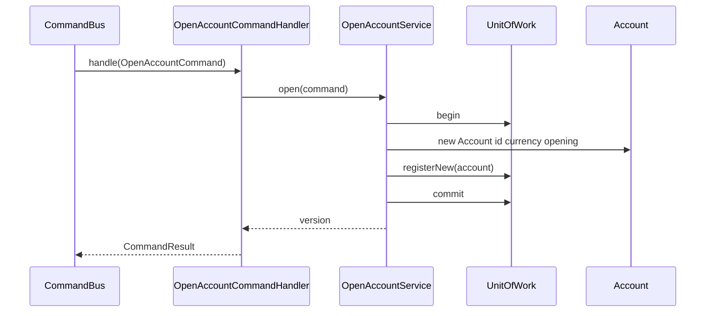

### 7.2 BookCreditCommand

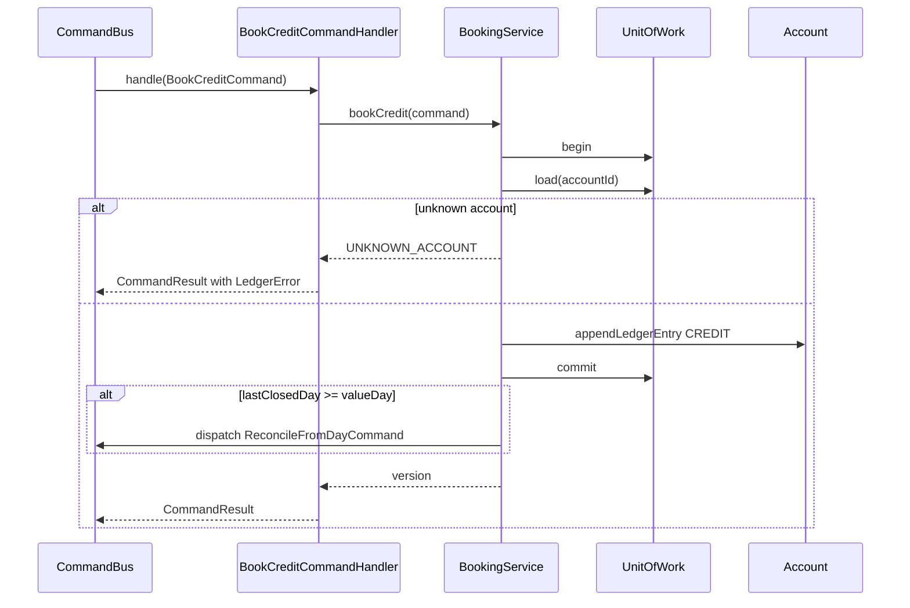

### 7.3 BookDebitCommand

E2 and E7. Booked amount may go negative; overdraft is assessed at close / recon.

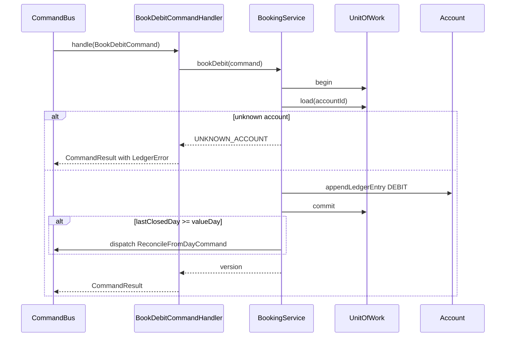

### 7.4 CreditInstalmentsCommand

E10. Three rows `E10:1`, `E10:2`, `E10:3` in one commit.

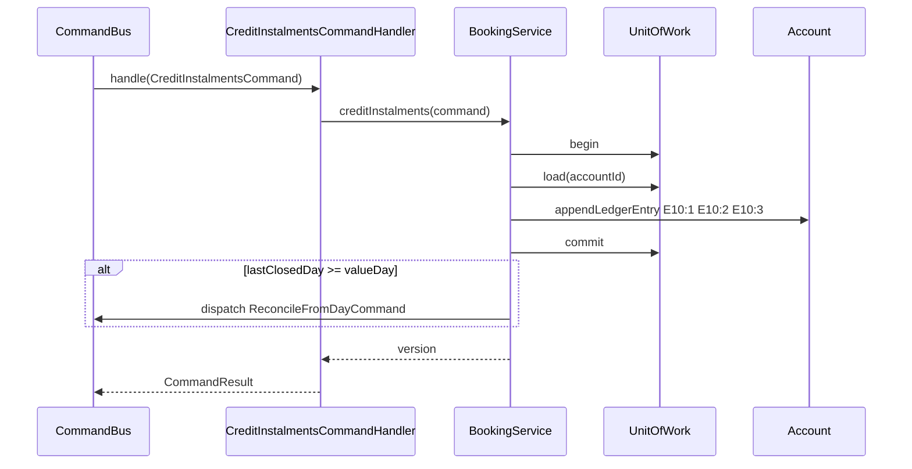

### 7.5 AuthorizeCommand

E3 and E8. No ledger row. Available = amount − holds.

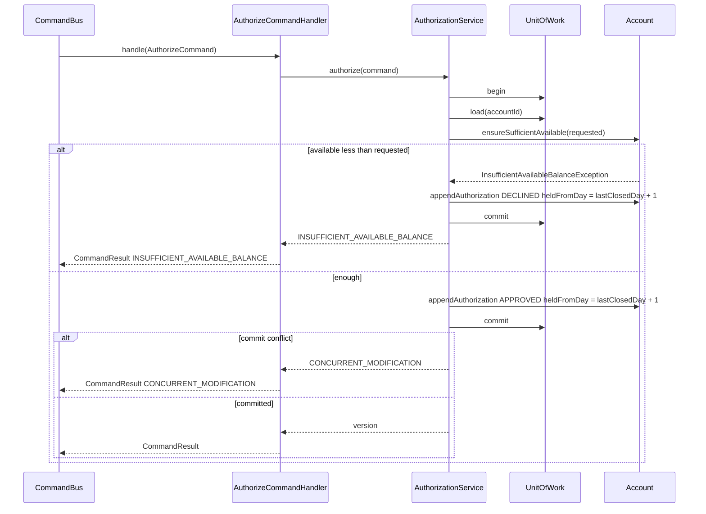

### 7.6 SettleAuthorizationCommand

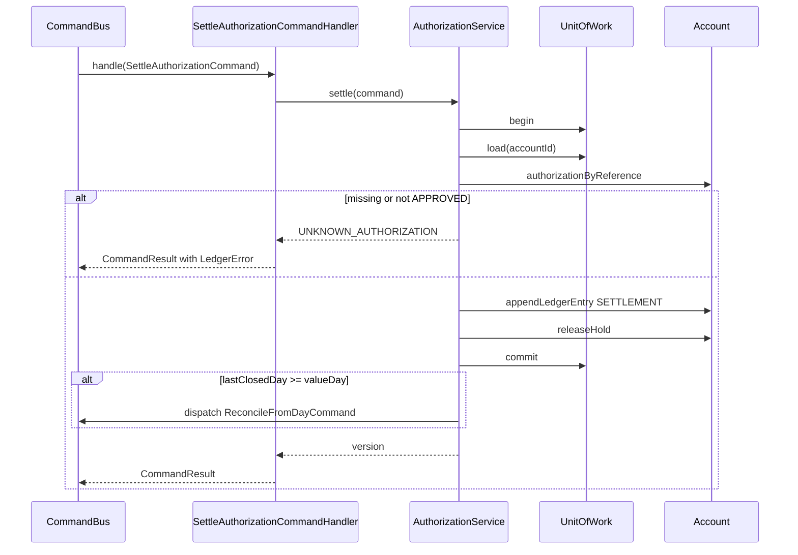

### 7.7 ReverseTransactionCommand

E9 reverses E7. Books `REVERSAL` on the original `valueDay`, then reconcilies closed days.

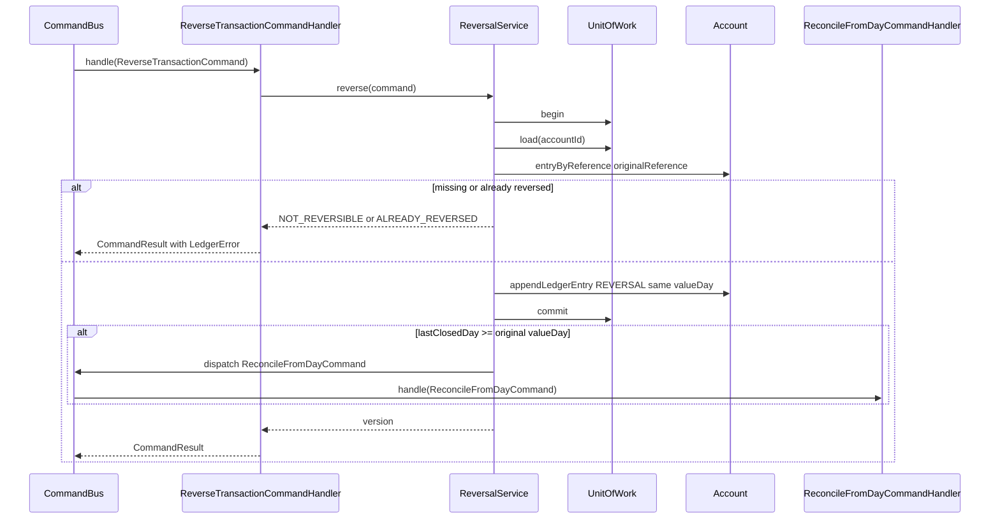

### 7.8 EndOfDayCommand

Always writes `accruedDailyInterestByDay[day]`. Accrual is not a ledger row.

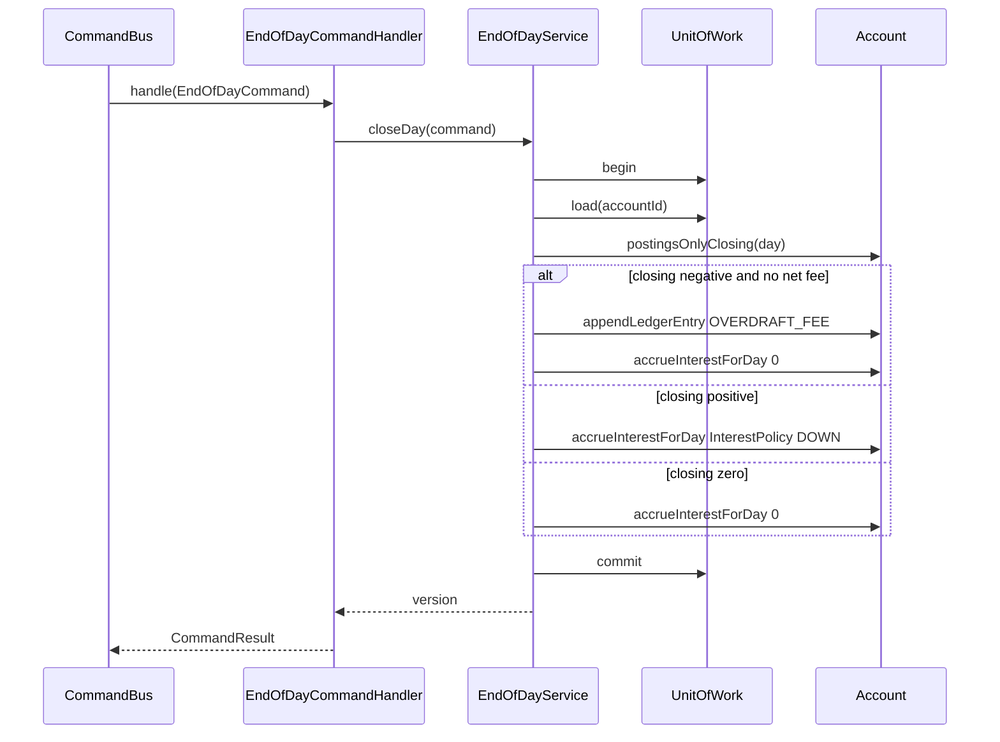

### 7.9 ReconcileFromDayCommand

Starts at `closingBalance(fromDay - 1)` (opening plus signed amounts, not a prior row’s `balanceAfter`). Walks each day, appends fee or fee reversal, overwrites accruals. Existing row before/after stay as committed at append time.

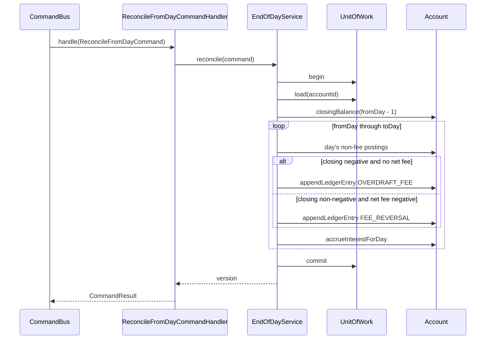

### 7.10 CapitalizeInterestCommand

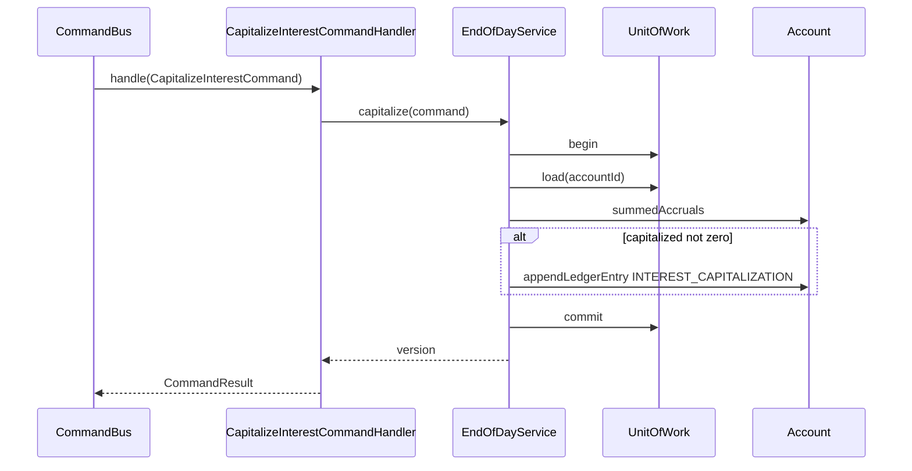

### 7.11 EndOfDayBatchCommand

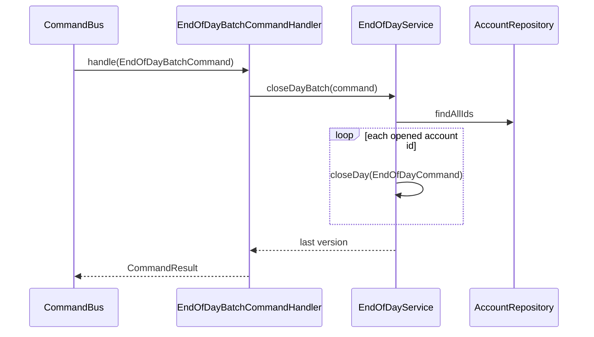

### 7.12 Simulation day

The engine dispatches commands only. Reconcile, when needed, is issued by the posting service.

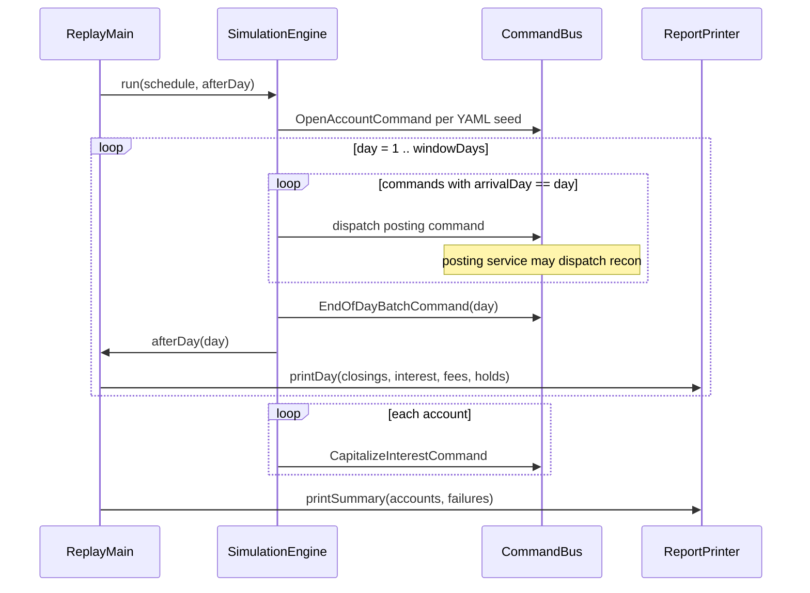

---

## 8. Commands

| Command | Behaviour |
|---|---|
| `OpenAccountCommand` | `registerNew` + `commit`. |
| `BookCreditCommand` | Append `CREDIT`. After commit, recon if the value day is already closed. |
| `BookDebitCommand` | Append `DEBIT`. After commit, recon if backdated. E2 and E7. |
| `CreditInstalmentsCommand` | Three rows `E10:1/2/3`, one commit, then recon if backdated. |
| `AuthorizeCommand` | `APPROVED` or `DECLINED` + commit. No ledger row. |
| `SettleAuthorizationCommand` | `SETTLEMENT` + full hold release. Unknown / declined auth → `UNKNOWN_AUTHORIZATION`. Recon if backdated. |
| `ReverseTransactionCommand` | `REVERSAL` on the original `valueDay`, then recon if that day is closed. |
| `EndOfDayCommand` | Fee if negative postings-only closing; always accrue interest. |
| `ReconcileFromDayCommand` | Previous-day close, then day walk; fee / fee reversal; overwrite accruals. |
| `CapitalizeInterestCommand` | `INTEREST_CAPITALIZATION` = sum of the accrual map. |
| `EndOfDayBatchCommand` | `closeDay` for each id from `findAllIds()`. |

---

## 9. Simulation and reports

`SimulationEngine` opens the YAML seeds, then for each calendar day dispatches that day’s arrivals, then `EOD-D{day}`, then `afterDay`. After the window it capitalizes each account.

```text
open ACC-001, open ACC-002
E1, E2, EOD-D1
E3, EOD-D2
E4, EOD-D3
E5, E6, EOD-D4
E7 (books overdraft; BookingService recon D2..D4),
E8 (Auth-B declined),
EOD-D5
E9 (reverse E7; ReversalService recon D2..D5),
E10 (late instalments value day 5; BookingService recon D5..D5),
EOD-D6
CAPITALIZE:ACC-001, CAPITALIZE:ACC-002
```

`ReplayMain` prints each day’s snapshot after EOD, then account totals and command failures after capitalization. Daily `interest` is that day’s accrual at print time. A later recon can rewrite earlier days’ accruals; those earlier lines are already printed.

Errors live on `CommandResult` / `SimulationResult`.

---

## 10. Packages

```text
com.mal.assignment
├── accounts
│   ├── domain
│   │   ├── models             Account, Authorization, LedgerEntry, LedgerEntryType,
│   │   │                      Currency, MinorUnits, FailureReason, LedgerError
│   │   ├── commands           sealed Command hierarchy
│   │   ├── commandhandlers    one handler per command
│   │   ├── repositories       AccountRepository
│   │   ├── unitofwork         UnitOfWork, UnitOfWorkFactory
│   │   ├── buses              CommandBus
│   │   ├── services           BookingService, AuthorizationService, ReversalService,
│   │   │                      EndOfDayService, OpenAccountService,
│   │   │                      OverdraftPolicy, InterestPolicy, ReconciliationTrigger, LedgerPolicies
│   │   └── reports            DailySnapshot, DailyReport, AccountReport, ScenarioReport, ReportBuilder
│   └── infrastructure
│       ├── repositories       InMemoryAccountRepository, StoredAccount
│       ├── unitofwork         InMemoryUnitOfWork, InMemoryUnitOfWorkFactory
│       ├── buses              InMemoryCommandBus
│       ├── config             LedgerConfig, YamlLedgerConfigLoader
│       └── reports            ReportPrinter
├── simulation                 SimulationEngine, ScenarioFixture, ScheduledCommand,
│                              Checkpoint, SimulationResult
└── ReplayMain
```

`AccountsModule` constructs services, then handlers, then registers them on `InMemoryCommandBus`.

---

## 11. Config

```yaml
ledger:
  window-days: 6
  rounding-mode: DOWN
  currencies:
    AED: { scale: 2 }
    BHD: { scale: 3 }
  interest:
    daily-rate-numerator: 4
    daily-rate-denominator: 10000
    capitalization-day: 6
  overdraft:
    fees-in-minor-units:
      AED: 2500
      BHD: 25000
  accounts:
    - id: ACC-001
      currency: AED
      opening-balance-in-minor-units: 0
    - id: ACC-002
      currency: BHD
      opening-balance-in-minor-units: 0
```

---

## 12. Verified arithmetic

Minor units. Rate `floor(closing × 4 / 10000)`.

After the full replay (E7 booked on day 5, reversed on day 6):

- ACC-001 D1–D6 closings `25000, 25000, 65000, 46500, 46500, 46600`. Capitalized `100` (`10+10+26+18+18+18`).
- ACC-002 D5 `10000`, D6 `10008`. Capitalized `8` (`4` on D5 after E10 recon + `4` on D6).
- Failures: E6 `UNKNOWN_AUTHORIZATION`, E8 `INSUFFICIENT_AVAILABLE_BALANCE` (authorize 90000).

The day-5 print (before E9) shows ACC-001 overdrawn: E7 is live, OD fees are booked, D5 interest is `0`. E9 restores D2–D5 accruals. Summing the printed daily interest therefore does not equal capitalized interest.

---

## 13. Tests

- `AccountsModuleTest` — handlers are constructed with the domain service
- `InMemoryUnitOfWorkTest` — handlers stub `UnitOfWork`
- `AccountPutIfAbsentTest` — second append with the same key leaves amount unchanged
- `LedgerConsistencyTest` — closing is opening plus signed amounts; a row’s before/after is stale unless it is still the last entry of that value day
- `BookCreditTest` / `BookDebitTest` — committed row has both balance fields; debit may overdraw; backdated debit reconcilies
- `ReconciliationTest` — existing before/after unchanged; recon from a later day starts at the previous close including fees
- `ScenarioAcceptanceTest` / `SimulationEngineTest` — assignment goldens after E9; engine dispatched ids omit nested `:recon`
- `BackdatedAfterCapitalizationTest` — tagged `known-limitation`, excluded in Surefire
